# ClassLink 1.0 : code des diagrammes

Chaque bloc ci-dessous correspond à une figure du cahier des charges.

- **Mermaid** : coller le code sur https://mermaid.live puis exporter en PNG ou SVG.
- **PlantUML** : coller le code sur https://www.plantuml.com/plantuml puis télécharger le PNG ou SVG.
- **draw.io** : Organiser, Insérer, Avancé, puis Mermaid ou PlantUML.

---

## Figure 1 : Diagramme de cas d'utilisation général

Outil : PlantUML

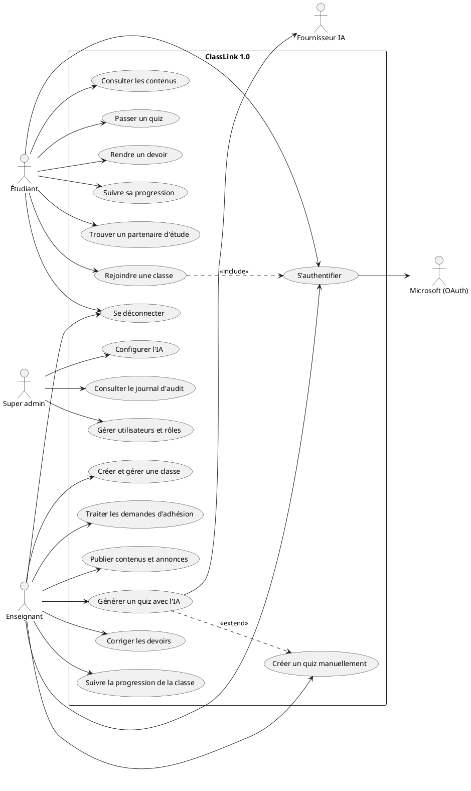

---

## Figure 2 : Diagramme d'activité : parcours complet d'un étudiant, de la connexion à la déconnexion

Outil : Mermaid

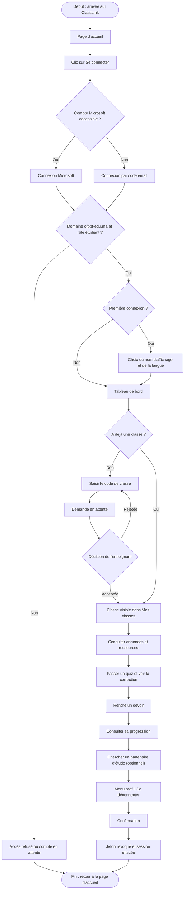

---

## Figure 3 : Diagramme d'activité : parcours complet d'un enseignant

Outil : Mermaid

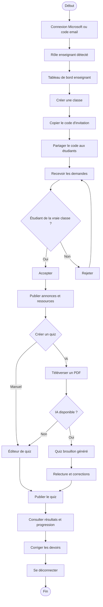

---

## Figure 4 : Diagramme d'activité : traitement d'une demande d'adhésion

Outil : Mermaid

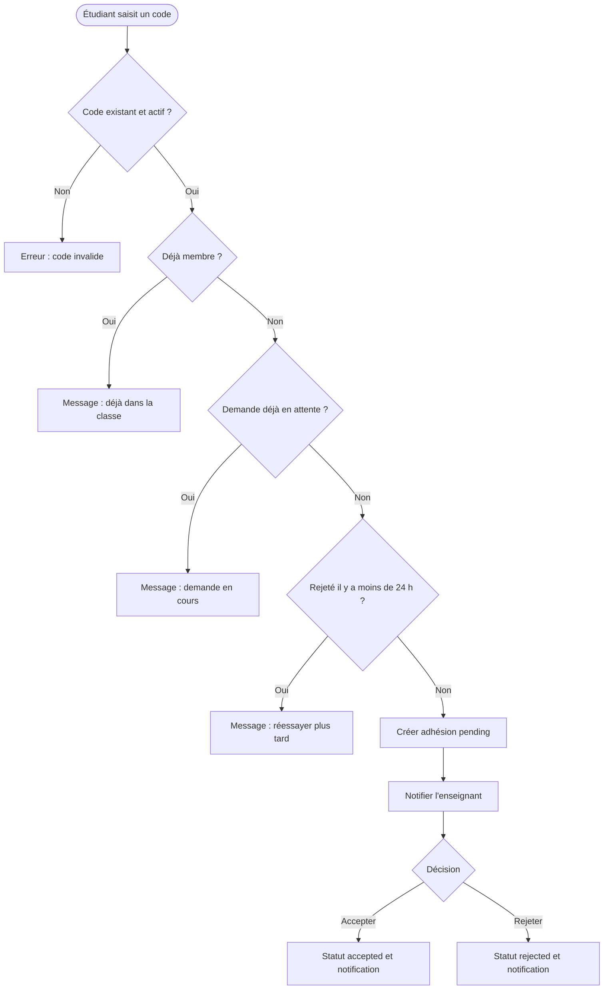

---

## Figure 5 : Plan du site (arborescence des écrans)

Outil : Mermaid

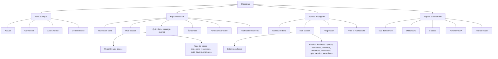

---

## Figure 6 : Diagramme de classes

Outil : Mermaid

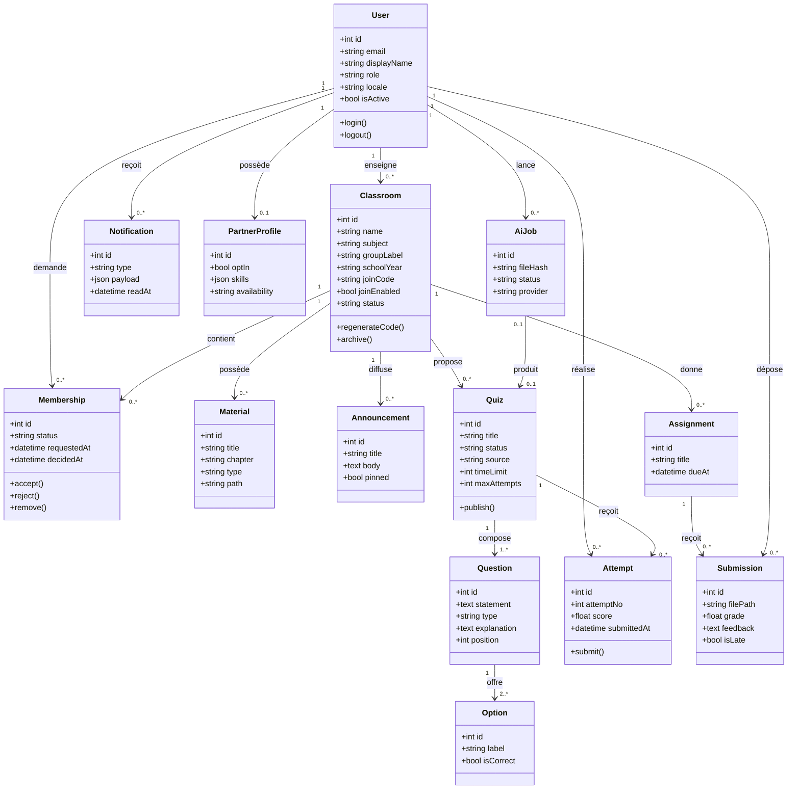

---

## Figure 7 : Modèle entité-association (base de données)

Outil : Mermaid

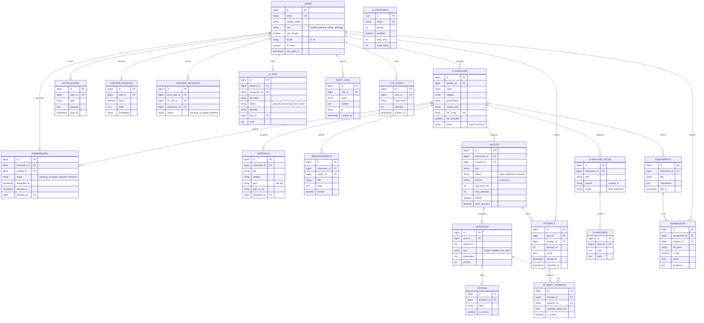

---

## Figure 8 : Diagramme d'états : adhésion à une classe

Outil : Mermaid

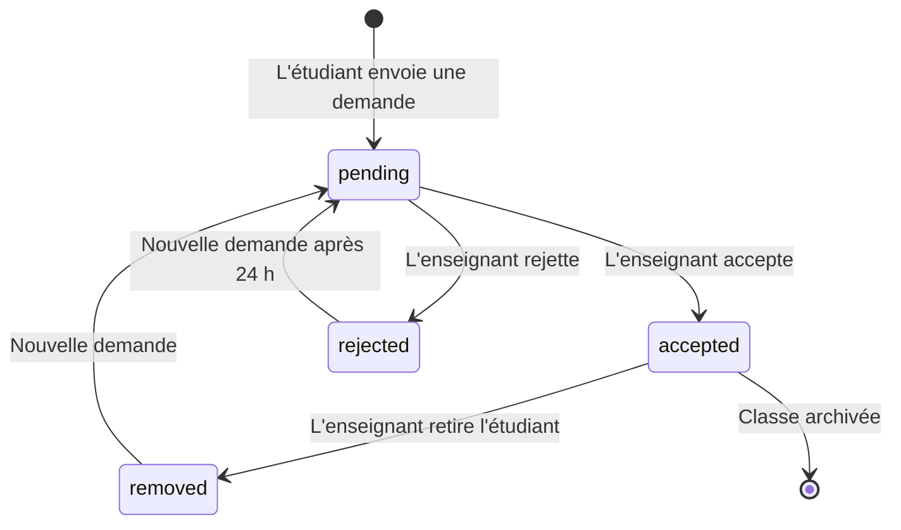

---

## Figure 9 : Diagramme d'états : quiz et tâche IA

Outil : Mermaid

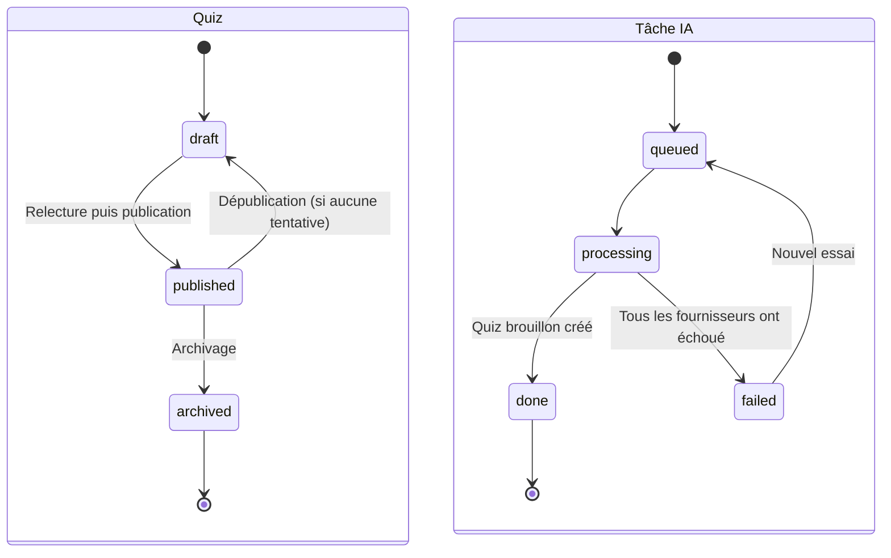

---

## Figure 10 : Diagramme de séquence : connexion Microsoft et détection du rôle

Outil : Mermaid

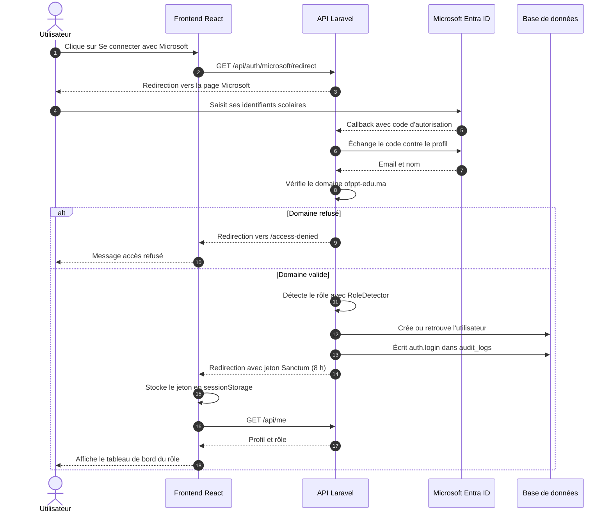

---

## Figure 11 : Diagramme de séquence : connexion de secours par code email

Outil : Mermaid

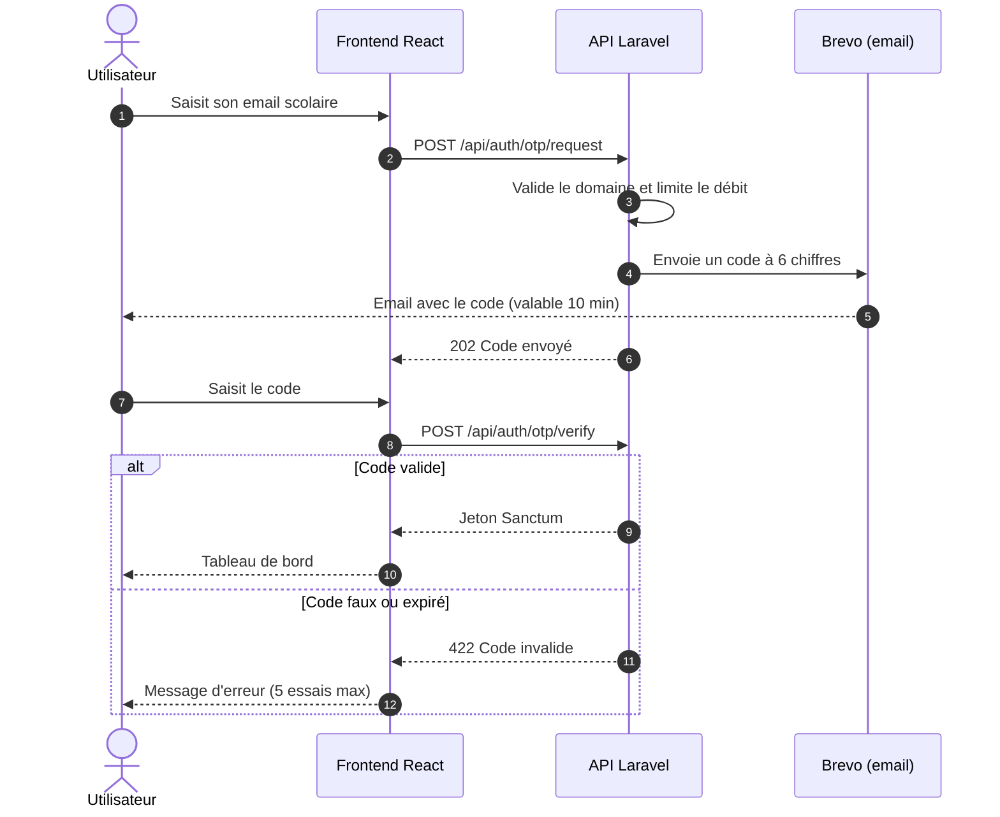

---

## Figure 12 : Diagramme de séquence : demande d'adhésion à une classe

Outil : Mermaid

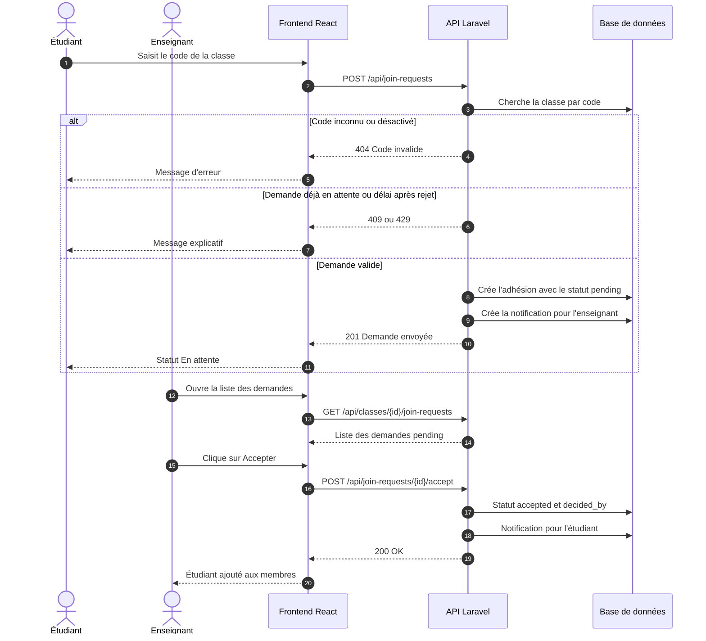

---

## Figure 13 : Diagramme de séquence : génération d'un quiz par l'IA avec bascule de fournisseur

Outil : Mermaid

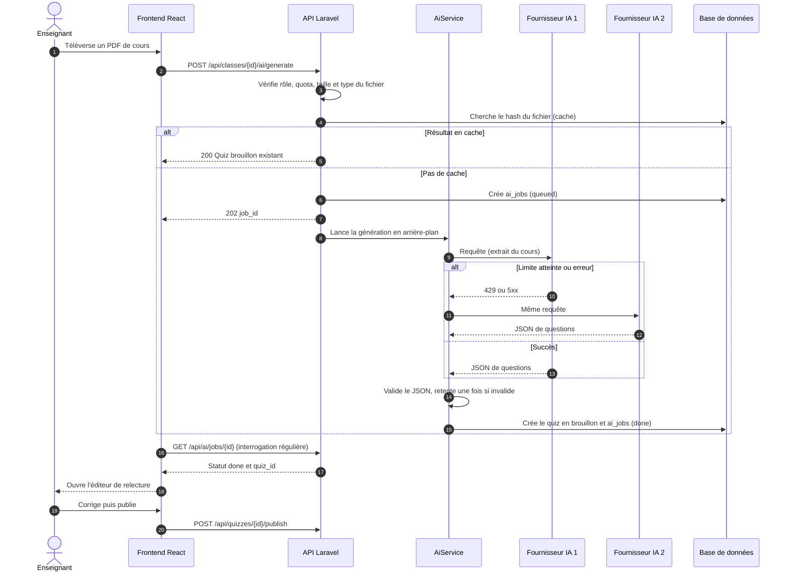

---

## Figure 14 : Diagramme de séquence : passage d'un quiz par un étudiant

Outil : Mermaid

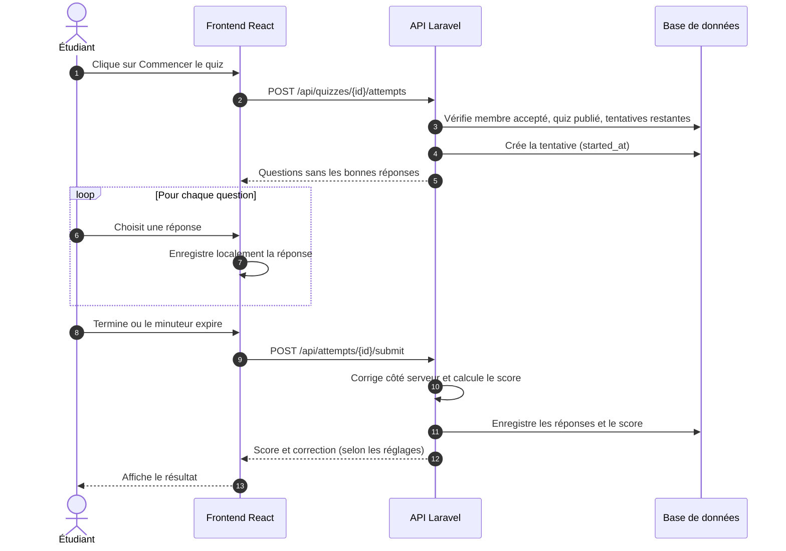

---

## Figure 15 : Diagramme de séquence : déconnexion et expiration de session

Outil : Mermaid

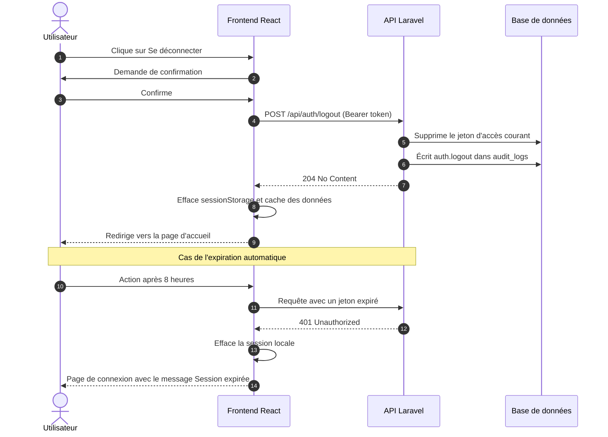

---

## Figure 16 : Architecture technique globale

Outil : Mermaid

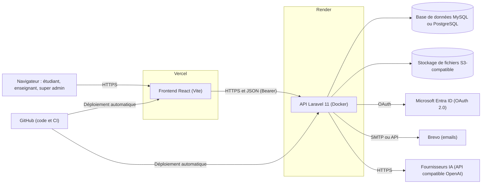

---

## Figure 17 : Planning prévisionnel (diagramme de Gantt)

Outil : Mermaid

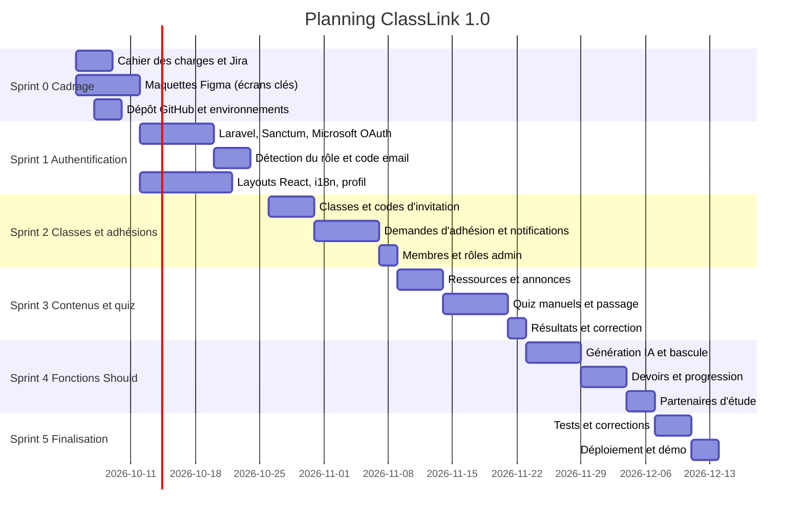

